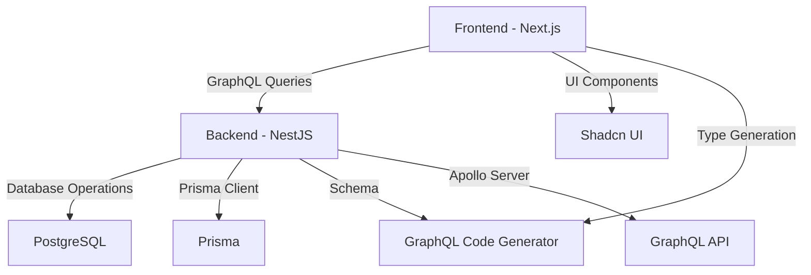

# System Patterns

## Architecture Overview
The project follows a monorepo architecture with two main applications:
1. Frontend (Next.js 15)
2. Backend (NestJS with Apollo Server)

## Design Patterns

### Frontend Patterns
- Component-based architecture
- Server-side rendering with Next.js
- UI components using Shadcn
- TypeScript for type safety
- GraphQL Code Generator for type-safe operations

### Backend Patterns
- NestJS modular architecture
- Apollo Server for GraphQL implementation
- Repository pattern with Prisma
- Dependency injection
- Dynamic module configuration
- Environment-based configuration

## Component Relationships


## Key Technical Decisions
1. Monorepo structure for better code sharing and management
2. Apollo Server for GraphQL implementation
3. Prisma for database operations
4. TypeScript for type safety across the stack
5. Shadcn UI for consistent design system
6. GraphQL Code Generator for type-safe GraphQL operations
7. Dynamic module configuration for flexibility

## Code Organization
```
monorepo-boilerplate/
├── apps/
│   ├── web/          # Next.js frontend
│   │   ├── src/
│   │   └── codegen.ts # GraphQL Code Generator config
│   └── api/          # NestJS backend
│       ├── src/
│       │   ├── dynamic-modules/  # Dynamic module configurations
│       │   ├── users/           # User module
│       │   ├── hello/           # Hello module
│       │   └── app.module.ts    # Root module
├── package.json      # Root package configuration
└── memory-bank/      # Project documentation
``` 