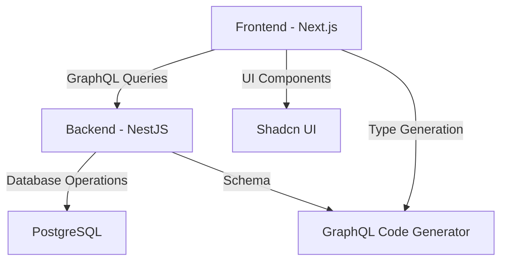

# System Patterns

## Architecture Overview
The project follows a monorepo architecture with two main applications:
1. Frontend (Next.js 15)
2. Backend (NestJS)

## Design Patterns

### Frontend Patterns
- Component-based architecture
- Server-side rendering with Next.js
- UI components using Shadcn
- TypeScript for type safety
- GraphQL Code Generator for type-safe operations

### Backend Patterns
- NestJS modular architecture
- GraphQL schema-first approach
- Repository pattern for database access
- Dependency injection

## Component Relationships


## Key Technical Decisions
1. Monorepo structure for better code sharing and management
2. GraphQL for flexible API communication
3. TypeScript for type safety across the stack
4. PostgreSQL for reliable data persistence
5. Shadcn UI for consistent design system
6. GraphQL Code Generator for type-safe GraphQL operations

## Code Organization
```
monorepo-boilerplate/
├── apps/
│   ├── web/          # Next.js frontend
│   │   ├── src/
│   │   └── codegen.ts # GraphQL Code Generator config
│   └── api/          # NestJS backend
├── package.json      # Root package configuration
└── memory-bank/      # Project documentation
``` 